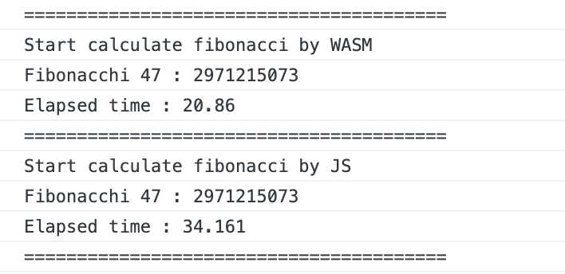

# wasm-helloworld

## Documents

https://qiita.com/kamykn/items/371cba5487d3c7cea8aa

## Step

- [x] Env
  - rustc 1.36.0-nightly (3f5152e20 2019-05-08)
  - npm 6.10.2
  - wasm-pack
  - cargo-generate
- [x] Clone the Project Template
  - 元資料通りにやるとディレクトリルートではなく新しくディレクトリに作られるのでちょっと注意
- [x] What's Inside
- [x] Build the Project
  - ビルドは問題なく通る。すんなりいって肩透かし感ある
- [x] Putting it into a Web Pages
  - 中身は特に普通のHTML/JS郡
- [x] Install the dependencies
- [x] Using our Local wasm-game-of-life Package in www
  - `npm link` をよく理解していないので後で理解する必要あり
- [x] Serving Locally
- [x] Exercises
- [x] Extra Stage
  - フィボナッチ数の計算をJSとWASMで比較してみる
  - 結果的に1.5倍ほどWASMのほうが早かった
    - JSのNumberが64bitの浮動小数点型で、整数は53bitまでしか取り扱えない
      - そのためJSから渡すときにはBigintで渡す必要があることに注意
      - `calc_fibonacci(47)` ではなく、`calc_fibonacci(BigInt(47))`が正しい。もしくは `calc_fibonacci(47n)`

## Benchmark

## Issues

- `npm link` の理解をする